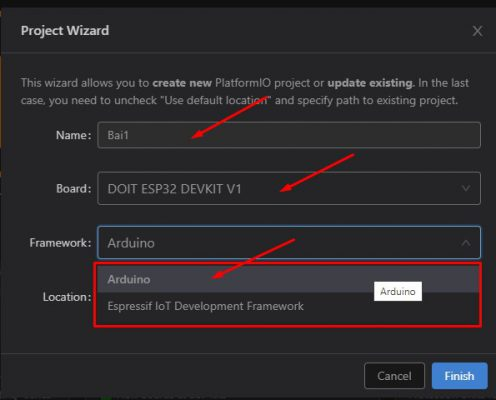
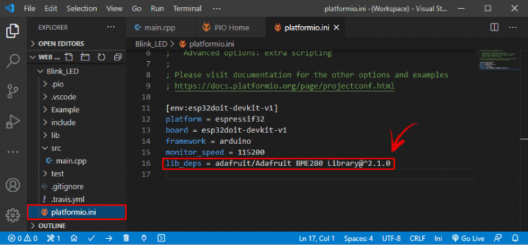
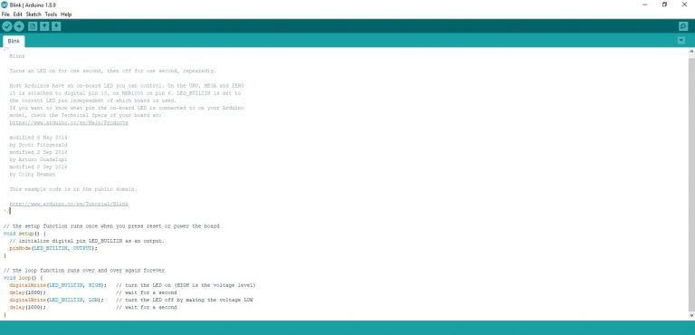
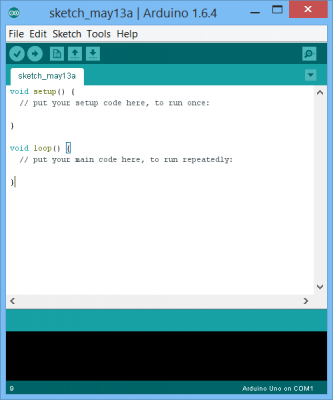
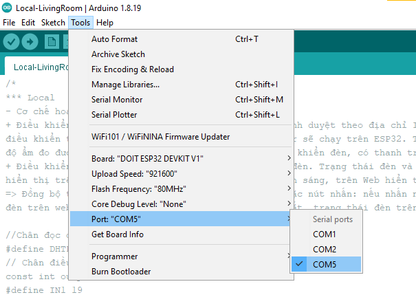
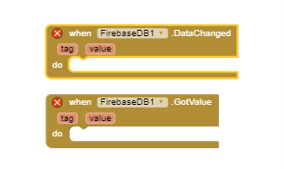
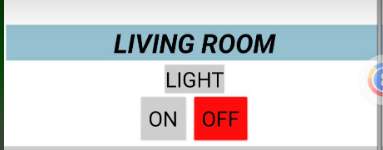

# I. Cài đặt và sử dụng phầm mềm
## 1. Platform IO lập trình ESP32
**Ứng dụng trong dự án:** Lập trình vi điều khiển ESP32 cho End Devices và Gateway.

[Link hướng dẫn chi tiết](https://khuenguyencreator.com/huong-dan-cai-dat-platform-io-lap-trinh-esp32/)
## Cài đặt Visual Studio Code (VS Code)
Truy cập link: https://code.visualstudio.com/
Download và Cài đặt như một software bình thường.
## Cài đặt Platform IO
Trước khi cài Extension này, chúng ta cần cài đặt Python cho máy tính đã.


Truy cập link: https://www.python.org/downloads/.  
**Lưu ý**: Hãy tích chọn Add Python 3.8 to PATH để có thể run Python ở bất cứ đâu.  
Sau đó mở VS code, chuyển đến tab Extension, trong ô tìm kiếm gõ    **Platformio IDE**.
Nhấn cài đặt, sau khi cài đặt xong sẽ hiển thị như hình:

  
Restart lại VS code sau đó chờ cho tất cả các extension được load.
**Lưu ý:** máy tính bạn cần phải có mạng nhé.
## Cài đặt Driver nạp cho mạch.
Tùy vào trường hợp mạch bạn sử dụng IC UART nào, chúng ta sẽ cài đặt driver cho chip đó:
Thường là 2 loại:
CP210x: [Link download và cài đặt](https://sparks.gogo.co.nz/ch340.html).
CH340:  [Link download và cài đặt](https://sparks.gogo.co.nz/ch340.html).
## Hướng dẫn sử dụng Platform IO lập trình ESP32
Tạo một dự án lập trình ESP32 với Platform IO.
Chúng ta nhấn vào biểu tượng logo của Platform io, trong tab Quick Acccess nhấn Open. Vs code sẽ mở ra trang PIO Home.
Sau đó nhân vào New Project để tạo 1 dự án mới
Đặt tên dự án, Chọn KIT sử dụng, ở đây là board DOIT ESP32 DEV KIT (loại thường gặp nhất đó).
Chọn Framwork là Arduino:



Bỏ tick Use Defaul Location, sau đó trỏ tới nơi bạn lưu project, nhấn Finish để hoàn thành.


Giao diện lập trình của Platform IO
Sau khi project được tạo, giao diện như sau:


**Gồm :**
- **Phần cây thư mục dự án:** cho chúng ta thêm, sửa, xóa các file nhanh
Phần Text editor: là nơi viết code
- **Cửa sổ Terminal:** Nơi gõ các câu lênh
**Thanh công cụ:** Lần lượt là Home, Build, Upload code, Clean, Serial Monitor(màn hình serial), Terminal
- **Thư mục Src:** Chứa Source code của chương trình, đây là nơi lưu trữ code và bạn sẽ code trên đó. File thực thi chính là: main.cpp
**Ứng dụng trong dự án:** Lập trình vi điều khiển ESP32 cho End Devices và Gateway

Trên thực tế, các bạn có thể Copy trực tiếp các đoạn code viết bằng Arduino IDE và Paste thẳng vào đây. Chỉ cần giữ **#include <Arduino.h>** là code cũng có thể chạy bình thường.
Thế nên các dự án mà bạn viết bằng Arduino cũng đều có thể viết bằng VS code nhé.
File platformio.ini là file cấu hình PlatformIO cho project của bạn. Nó hiển thị các thông tin như platform, board và framework được sử dụng. Bạn cũng có thể thêm các cấu hình khác như các thư viện được đưa vào, tùy chọn upload code, hay tốc độ truyền của Serial Monitor, đường dẫn thư viện và các cấu hình khác.
Thực tế các bạn nên để nguyên.
Nếu muốn thay đổi tốc độ baud của Serial Monitor có thể sử dụng lệnh: **monitor_speed = 115200**.
Nếu muốn thêm đường dẫn của thư viện chúng ta dùng: lib_deps = E:/thuvien 
Trong đó E:/thuvien là đường dẫn tới file thư viện bạn cài đặt
## Cài đặt thư viện cho Platformio
### Sử dụng công cụ Libraly trong Platformio
- Làm theo quy trình dưới đây nếu bạn cần cài đặt thư viện trong PlatformIO IDE.
- Nhấp vào biểu tượng Home để chuyển đến Trang chủ PlatformIO. Nhấp vào biểu tượng Libraries trên thanh bên trái.
- Tìm kiếm thư viện bạn muốn cài đặt. Ví dụ Adafruit_BME280 .


Nhấp vào thư viện bạn muốn đưa vào dự án của mình. Sau đó, nhấp vào Add to Project.


Chọn dự án bạn muốn sử dụng thư viện.


Thao tác này sẽ thêm code định danh thư viện bằng cách sử dụng lid_depschỉ thị trên file platformio.ini . Nếu bạn mở file platformio.ini của dự án , nó sẽ trông nh thể hiện trong hình ảnh sau.



Ngoài ra, trên cửa sổ thư viện, nếu bạn chọn tab Installation và cuộn một chút, bạn sẽ thấy code định danh cho thư viện. Bạn có thể chọn bất kỳ số nhận dạng nào tùy thuộc vào tùy chọn bạn muốn sử dụng. Các mã nhận dạng thư viện được đánh dấu màu đỏ.


## Build và Upload code cho ESP32 bằng Platform IO
Mình sẽ chọn một example huyền thoại là Blink Led trên Arduino IDE, copy đoạn code đó, sau đó paste vào VS code



Nhớ giữ lại **#include <Arduino.h>** nhé!


Sau đó nhấn Build để biên dịch chương trình, Khi terminal báo Success là ok. Nếu chương trình có lỗi, hãy chuển tab Problems để view lỗi nhé!
Cắm mạch vào và nhấn Upload, nếu đến đoạn connecting mà vscode ko tìm thấy esp, các bạn nhấn nút BOOT trên mạch giữ 1 chút rồi nhả ra nhé. Để ESP vào chế độ Nạp.


Sau khi nạp xong, thì xem thành quả thôi!!!
## 2. Hercules Terminal
**Ứng dụng trong dự án:** UART để hiển thị các dữ liệu truyền nhận được giữa End Devices và Gateway, hỗ trợ mô phỏng để kiểm tra dữ liệu.
[Link hướng dẫn chi tiết](https://khuenguyencreator.com/huong-dan-hercules-terminal/)
Hercules Terminal cũng như các phần mềm Terminal khác dùng để đọc chuỗi nhận được thông qua các cổng khác nhau trên máy tính.
Trong bài viết này mình chỉ đề cập tới việc sử dụng cổng COM hay Serial để đọc và truyền dữ liệu
Đầu tiên các bạn **Download** tại link:  [Hercules Terminal](https://www.fshare.vn/file/DI61DGWVGBXH?token=1676858630)
**Truyền nhận Serial với Hercules Terminal**
Mở Terminal lên chọn Tab Serial – Name = Cổng COM mà bạn đang sử dụng (ở đây mình đang dùng COM4), Baud set cho phù hợp với ứng dụng của bạn. Nhấn Open


Hướng dẫn Download và sử dụng Hercules Terminal 44
Vậy là bạn có thể truyền nhận dữ liệu thông qua cổng COM rồi nhé.
## 3. Arduino
**Ứng dụng trong dự án:** UART để hiển thị các dữ liệu truyền nhận được giữa End Devices và Gateway, hỗ trợ mô phỏng để kiểm tra dữ liệu theo thời gian.
[Link hướng dẫn chi tiết](https://khuenguyencreator.com/bai-1-huong-dan-cai-dat-arduino-ide-va-cach-them-thu-vien/)
**Bước 1:** Truy cập địa chỉ này để cài đặt [Arduino IDE](https://www.arduino.cc/pro/software-arduino-pro-ide/). Đây là nơi lưu trữ cũng như cập nhật các bản IDE của Arduino. Bấm vào mục **Windows ZIP file**  như hình minh họa.


Bạn sẽ được chuyển đến một trang mời quyền góp tiền để phát triển phần mềm cho Arduino, tiếp tục bấm **JUST DOWNLOAD** để bắt đầu tải.


**Bước 2:** Sau khi download xong, các bạn bấm chuột phải vào file vừa **download arduino-1.6.4-windows.zip** và chọn **“Extract here”** để giải nén.


**Bước 3:** Copy thư mục arduino-1.6.4 vừa giải nén đến nơi lưu trữ.
**Bước 4:** Chạy file cài đặt trong thư mục arduino để cài đặt Arduino IDE và khởi động nó lên. 



Như vậy chúng ta đã cài đặt Arduino IDE xong.

**Cài đặt Serial**
Cài đặt **Port** truyền nhận dữ liệu (ở đây mình đang dùng COM5) và tốc độ truyền ở **Upload Speed**.



Serial trên Adrunino có chế độ **Show Timestamp** để hiển thị thời gian truyền nhận đến **ms**.


# II. Triển khai dự án
## 1. End Devices
## 2. Gateway
## 3. Firebase
## 4. Triển khai Gateway để truyền nhận dữ liệu tương tác với Firebase
## 5. Triển khai App MIT Inventor để đọc và gửi dữ liệu tương tác với Firebase
Nhóm em sẽ sử dụng App để phục vụ hai chức năng chính của hệ thống: 
. Chức năng hiển thị trạng thái của Đèn và một số kịch bản như hiển thị nhiệt độ, trạng thái của cảm biến hồng ngoại, …
+) Để có thể đọc được dữ liệu từ Firebase đến App, nhóm em sử dụng chức năng của một số khối sau để thực hiện: 



+) Ở đây khi Database ở Firebase thay đổi khối “When FirebaseDB1. Data Changed” sẽ nhận được và đọc dữ liệu thay đổi đó.
+) Sau đó khối “When FirebaseDB1. GotValue” sẽ đọc và hiển thị lên App dữ liệu vừa nhận được.
+) Ví dụ như đây là trạng thái của đèn phòng khách được hiển thị trên App:



+) Hoặc đây là nhiệt độ của phòng bếp được hiển thị trên App: 


. Chức năng điều khiển các thiết bị ví dụ như điều khiển bật/tắt đèn, điều khiển mức quạt và rèm theo kịch bản của hệ thống.
+) Điều khiển bật/tắt đèn: Nhóm em sẽ điều khiển thông qua các nút nhấn có trên App với chức năng khi nút nhấn được nhấn sẽ gửi dữ liệu xuống Firebase rồi sau đó Firebase sẽ gửi dữ liệu đó xuống các thiết bị chấp hành. 


+) Điều khiển quạt/rèm: Ở đây nhóm em sẽ điều khiển thông qua thanh trượt có tên “Slider” trên App. Tương tự như nút nhấn, nếu giá trị thanh trượt thay đổi thì sẽ gửi dữ liệu đó về Firebase và Firebase sẽ gửi xuống các thiết bị chấp hành. 
+) Ví dụ như ở đây nhóm em đang cho Rèm có 3 mức là 0/1/2 tương ứng với 3 kịch bản là OFF/ON1/ON2. Trong đó ON1 là mở 50% và ON2 là mở 100%. 


. Giao diện hoàn thiện của App:


## 6. Điều khiển Local
### 6.1 Cơ sở lý thuyết
#### 6.1.1 Web Server
Web Server là nơi lưu trữ, xử lý và cung cấp các trang web đến các Web Client. Web Client là một trình duyệt trên Laptop và Smartphone. Giao tiếp giữa Client và Server diễn ra bằng 1 giao thức đặc biệt gọi là Giao thức truyền siêu văn bản (HTTP- Hypertext Transfer Protocol).


Cụ thể hơn sẽ là như thế này:


Trong giao thức này, client bắt đầu giao tiếp bằng các đưa ra yêu cầu cho một trang web cụ thể bằng HTTP request và máy chủ phản hồi bằng nội dung của trang web đó hoặc thông báo lỗi nếu không thể thực hiện được (ví dụ như Error 404 not Found). Các trang do máy chủ phân phối chủ yếu là HTML.

Để dễ hình dung, khi có một client truy cập vào địa chỉ IP của webserver thì browser sẽ gửi cho server một http request (ứng với GET trong code). Ngay khi nhận được request này server sẽ gửi lại một http response (ứng với request->send trong code) có chứa nội dung là file html: index_html của webserver. 
```c
server.on("/", HTTP_GET, [](AsyncWebServerRequest *request){
    request->send_P(200, "text/html", index_html, processor);
  });
```

```c
// Tạo giao diện cho Web Server
const char index_html[] PROGMEM = R"rawliteral(
<!DOCTYPE HTML><html>
<head>
```
Hàm response file index_html cho Web Client:


Giao diện từ file html khi truy cập địa chỉ IP của ESP32: 192.168.0.117.

**Điều khiển từ Web Server ESP32**

“Làm cách nào để điều khiển từ một Web Server chỉ đơn thuần xử lý và cung cập các trang web?” Vậy thì chúng ta cần hiểu những gì khi client và server giao tiếp với nhau.
Khi nhập URL vào trình duyệt Web và nhấn Enter, trình duyệt sẽ gửi một HTTP Request (còn gọi là Get Request) đến Web Server. Công việc của Web Server là xử lý yêu cầu này bằng cách làm 1 cái gì đó. Có thể dễ hình dung ra rằng chúng ta sẽ điều khiển bằng cách truy cập vào một URL cụ thể. Ví dụ: chúng ta sẽ đã nhập một URL như http://192.168.2.54/ledon trong trình duyệt. Sau đó, trình duyệt sẽ gửi một HTTP Request đến ESP32 để xử lý yêu cầu này. Khi ESP32 đọc yêu cầu này, chúng ta sẽ viết một hàm muốn bật led ngay trong hàm xử lý của ESP32 Web Server. Vì vậy, nó sẽ bật led và đồng thời gửi một trang web đến một trình duyệt hiển thị trạng thái led: on.
Hàm điều khiển sẽ xảy ra đồng thời khi Web Server vừa nhận được HTTP Request và đang trả về HTTP Response.

 

#### 6.1.2 AJAX

AJAX là chữ viết tắt của Asynchronous JavaScript and XML, AJAX = Asynchronous JavaScript and XML. Đây là một công nghệ giúp chung ta tạo ra những Web động mà hoàn toàn không reload lại trang nên rất mượt và đẹp. Vậy Asynchronous, JavaScript, XML trong từ AJAX là gì:

+) Asynchronous, hay nói ngắn hơn là Async – bất đồng bộ. Bất đồng bộ có nghĩa là một chương trình có thể xử lý không theo tuần tự các hàm. Sẽ không có quy trình, có thể nhảy đi bỏ qua bước nào đó. Ích lợi dễ thấy nhất của bất đồng bộ là chương trình có thể xử lý nhiều công việc một lúc.

+) JavaScript là một ngôn ngữ lập trình nổi tiếng. Trong số rất nhiều chức năng của nó là khả năng quản lý nội dung động của website và hỗ trợ tương tác với người dùng.

+) XML là một dạng của ngôn ngữ markup như HTML, chữ đầy đủ của nó là eXtensible Markup Language. Nếu HTML được dùng để hiển thị dữ liệu, XML được thiết kế để chứa dữ liệu.

  

Ajax là cách mà chúng ta xử lý dữ liệu tại một số phần nhỏ trên ứng dụng web mà không cần phải load lại toàn bộ trang web
Cả JavaScript và XML đều hoạt động bất đồng bộ trong AJAX. **Kết quả là, nhiều ứng dụng web có thể sử dụng AJAX để gửi và nhận data từ server mà không phải toàn bộ trang.**

#### 6.1.3 Nút nhấn
Xây dựng hàm xử lý khi nhấn nút và chống nhiễu: 
```c
void loop() {
// Nút nhấn cứng và đọc trạng thái nút nhấn
  int reading = digitalRead(buttonPin);
// Hàm xử lý chống dội phím
  if (reading != lastButtonState) {
// bắt đầu đếm 50ms (debounceDelay = 50)
    lastDebounceTime = millis();
  }
/* Khi đủ 50ms thì kiểm tra lại, nếu trạng thái nút nhấn vẫn thay đổi so với trạng 
 thái trước đó (buttonState) thì mới xác định có nhấn phím và đổi trạng thái đèn (ledState) */
  if ((millis() - lastDebounceTime) > debounceDelay) {
    // if the button state has changed:
    if (reading != buttonState) {
      buttonState = reading;
      // only toggle the LED if the new button state is HIGH
      if (buttonState == HIGH) {
        ledState = !ledState;
      }
    }
  }
// Điều khiển nút nhấn
  digitalWrite(output1, ledState);
// Lưu lại giá trị nút nhấn hiện tại
  lastButtonState = reading;
}
```
**6.1.4 Một số đoạn code quan trọng**
**a) Đồng bộ trạng thái đèn**
- Hàm gửi yêu cầu GET (http request) cập nhật trạng thái đèn 1s một lần vào URL “/state” từ Web Client
```cpp
<!-- Hàm cập nhật trạng thái đèn sau 1s -->
setInterval(function ( ) {
  var xhttp = new XMLHttpRequest();
  xhttp.onreadystatechange = function() {
    if (this.readyState == 4 && this.status == 200) {
      var inputChecked;
      var outputStateM;
      if( this.responseText == 1){ 
        inputChecked = true;
        outputStateM = "On";
      }
      else { 
        inputChecked = false;
        outputStateM = "Off";
      }
      document.getElementById("output").checked = inputChecked;
      document.getElementById("outputState").innerHTML = outputStateM;
    }
  };
  xhttp.open("GET", "/state", true);
  xhttp.send();
}, 1000 ) ;
</script>
```
- Sau khi nhận được yêu cầu từ Web Client vào URL “/state”, Web Server sẽ đọc trạng thái chân điều khiển đèn qua hàm digitalread() và phản hồi ( http response) cho Web Client bằng hàm request->send. Từ đó hiển thị đồng bộ trạng thái đèn trên Web.
```c
// Đọc trạng thái đèn và hiển thị lên web
// Send a GET request to <ESP_IP>/state
  server.on("/state", HTTP_GET, [] (AsyncWebServerRequest *request) {
    request->send(200, "text/plain", String(digitalRead(output1)).c_str());
  });
```
**b) Điều khiển tốc độ quạt**
- Khi thanh trượt tốc độ quạt thay đổi thì hàm updatesliderPWM sẽ được gọi. Web Client sẽ gửi 1 yêu cầu get vào URL/slider kèm theo giá trị của thanh trượt: sliderValue. 
```c
<!-- Hiển thị thanh trượt điều khiển quạt -->
  <h3>FAN SPEED</h3>
  <p><span id="textSliderValue">%SLIDERVALUE%</span></p>
  <p><input type="range" onchange="updateSliderPWM(this)" id="pwmSlider" min="0" max="9" value="%SLIDERVALUE%" step="1" class="slider2"></p>
<!-- Khi thanh ghi thay đổi thì lấy giá trị và hiển thị lên Web bằng 
cách tạo yêu cầu get -->
  <script>
  function updateSliderPWM(element) {
  var sliderValue = document.getElementById("pwmSlider").value;
  document.getElementById("textSliderValue").innerHTML = sliderValue;
  console.log(sliderValue);
  var xhr = new XMLHttpRequest();
  xhr.open("GET", "/slider?value="+sliderValue, true);
  xhr.send();
}
</script>
```
- Từ yêu cầu của http vào URL: /slider, web server sẽ nhận giá trị hiện tại của thanh trượt lưu vào biến sliderValue. Từ giá trị này em sẽ điều khiển tốc độ quạt thông qua hàm ledwrite(), sau đó phản hồi lại Web Client bằng hàm request -> send.
```c
server.on("/slider", HTTP_GET, [] (AsyncWebServerRequest *request) {
    String inputMessage;
    // GET input1 value on <ESP_IP>/slider?value=<inputMessage>
    if (request->hasParam(PARAM_INPUT)) {
      inputMessage = request->getParam(PARAM_INPUT)->value();
      sliderValue = inputMessage;
	  data = map(sliderValue.toInt(),0,9,0,255);
      ledcWrite(ledChannel,data);
    }
    else {
      inputMessage = "No message sent";
    }
    Serial.println(inputMessage);
    request->send(200, "text/plain", "OK");
  });
```
### 6.2 Web Server điều khiển Local

Phòng khách sẽ bao gồm nhiệt độ, độ ẩm đo được từ cảm biến DHT11, thanh trượt điều khiển tốc độ quạt từ 0 – 10, nút nhấn điều khiển và hiển thị trạng thái đèn trên Web.

Điều khiển trực tiếp có nút nhấn cứng để điều khiển đèn, trạng thái đèn khi điều khiển bằng nút nhấn sẽ được đồng bộ lên Web Server.

Nhiệt độ, độ ẩm sẽ được cập nhật tự động 10s 1 lần, trạng thái Led và quạt hiển thị đúng với thực tế.

 

 Đèn đang sáng, nút nhấn hiển thị trạng thái đang bật, State: On


 Đèn đang tắt, nút nhấn hiển thị trạng thái đang tắt, State: Off

Sử dụng **kỹ thuật Ajax** để chỉ cập nhật những thành phần thay đổi của dữ liệu thay vì tải lại cả trang.

Khi thao tác với nút nhấn cứng, trên web chỉ có trạng thái của nút nhấn và dòng chữ sau LIGHT BULB – State thay đổi từ On sang Off, còn trạng thái quạt không đổi, tên miền vẫn là **192.168.254**
